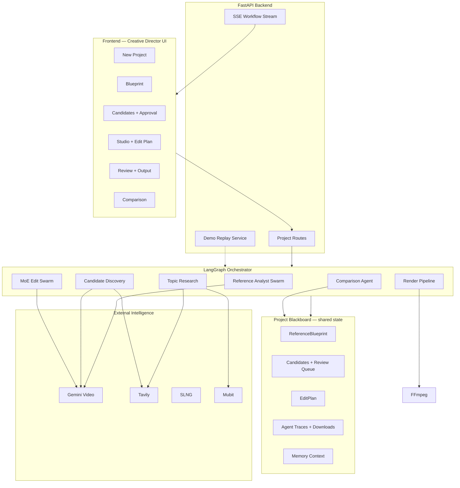

# EditDNA Rank Studio

**Reference-based AI ranking video generation with a multi-agent swarm, human approval gates, and durable memory.**

EditDNA Rank Studio lets a creator upload **one ranking video they admire** (typically a YouTube Short). The system extracts its **editing DNA** — hook timing, rank order, pacing, captions, motion, audio, transitions — then researches a **new topic**, discovers candidate clips from the open web, and builds a **new ranking video in the same style**. The human does not edit timelines manually; they act as **creative director**, approving or rejecting agent decisions at every critical step.

---

## For judges — read this first

You do **not** need to read source code to evaluate the system. This document explains **what** the product does, **why** it is technically non-trivial, and **how** to run the product end-to-end.

| Question | Answer in one line |
|----------|-------------------|
| What is the input? | A reference ranking video URL + a new topic |
| What is the output? | A stitched ranking Short in the reference style |
| Who is in control? | The user approves/rejects clips and edit plans |
| What AI is involved? | Gemini (video understanding), Tavily (research), SLNG (audio), Mubit (memory) |
| Why multi-agent? | Specialised agents + shared blackboard + traceable decisions |

**Suggested walkthrough (8–10 min):** New Project → Blueprint → Candidates (approve/reject clips) → Studio → Review → Comparison.

---

## The problem we solve

Ranking videos (e.g. “Top 5 …”) look simple but encode **repeatable editing grammar**:

- Hook in the first 2–3 seconds  
- Countdown or reveal order (5 → 1 or 1 → 5)  
- Consistent segment length and pacing  
- Caption / label overlays per rank  
- Motion emphasis on the #1 pick  
- Outro and audio rhythm  

Recreating that style for a **new topic** usually means hours of searching clips, trimming, labelling, and timing — or generic AI that ignores structure. EditDNA Rank Studio **learns structure from a reference**, then applies it to new content under **human supervision**.

---

## Creative director model (human-in-the-loop)

The product deliberately avoids “fire and forget” generation. Critical decisions pause for human approval:

```text
Reference video  →  Blueprint extracted  →  Topic research
       ↓
Candidate clips discovered one-by-one  →  USER approves or rejects each
       ↓
MoE agents propose edit plan           →  USER approves plan
       ↓
Final video rendered                   →  USER reviews + feedback
       ↓
Comparison vs reference              →  Memory updated for next run
```

**Rejections matter.** When a clip is weak for the topic, the user rejects it. The system:

1. Records the decision in **learning preferences** (visible in the UI)  
2. Fetches another candidate for that slot  
3. Excludes rejected footage from the **final edit plan and output**  
4. Surfaces “learned from rejection” in Studio AI feedback and Comparison  

This is intentional product design: **agents propose, humans dispose.**

---

## Technology stack

| Layer | Technology | Role |
|-------|------------|------|
| Frontend | Next.js, React, TypeScript | Project workflow UI, agent trace panel, approval gates |
| Backend | FastAPI, Python 3.11+ | REST + SSE streaming, orchestration |
| Workflow | LangGraph | Stage graphs, checkpoints, resumable pipelines |
| Video AI | Google Gemini | Reference blueprint + candidate visual analysis |
| Research | Tavily | Topic research, concept discovery, URL search |
| Audio | SLNG | Audio style analysis, voice / feedback intelligence |
| Memory | Mubit | Short-term, episodic, long-term preference memory |
| Media | FFmpeg, yt-dlp | Trim, scale, overlay, stitch; platform downloads |
| Persistence | SQLite + JSON blackboard | Project state, traces, memory context |

All integrations are **real API clients** in production mode. Missing API keys fail loudly — the UI shows which keys are absent via `/api/health`.

---

## System architecture



**Central idea:** agents do not pass opaque strings to each other. They read and write a typed **`ProjectBlackboard`** — blueprint, candidates, edit plan, traces, download events, memory — so every decision is **inspectable in the UI**.

---

## Reference DNA extraction (Blueprint)

When the user provides a reference ranking video (URL or file), a **Reference Analyst swarm** runs:

| Agent | Extracts |
|-------|----------|
| Video Probe | Duration, aspect ratio, Shorts vs regular, platform metadata |
| Structure & Pacing | Hook length, ranks count, average segment duration, reveal style |
| Audio Analysis | Music energy, voiceover pattern, rank stings |
| Format Detection | Mobile vs landscape constraints for later clip search |
| Blueprint Memory | Persists editing grammar to project memory |

Output: a **`ReferenceBlueprint`** — structured JSON describing editing grammar, not just a text summary. The Blueprint page visualises hook style, pacing, caption patterns, and rank structure. This blueprint **constrains** all later search, scoring, and edit planning.

---

## Topic research & candidate discovery

After the user enters a new topic:

1. **Tavily** researches the topic and proposes **candidate concepts** (one per rank slot).  
2. **Candidate Discovery** initialises a **sequential review queue** — one slot at a time.  
3. For each slot, a **Platform Search swarm** finds URLs (YouTube Shorts, TikTok, etc.).  
4. **yt-dlp** downloads clips into the project workspace.  
5. **Gemini candidate analysis swarm** scores topic match, visual quality, motion, reference style fit, and selects a highlight segment inside each clip.

Every search query, URL, download success/failure appears in:

- **Agent Trace panel** (reasoning + tool calls)  
- **Download events** timeline  
- **Mubit trace memory** (when configured)

The user sees **one candidate at a time** with scores and a video preview, then **Approve** or **Reject**. Rejections update learning preferences immediately.

---

## Mixture-of-Experts (MoE) edit pipeline

Edit planning is not a single LLM prompt. Four **parallel experts** propose adjustments, then a **Fusion** agent merges them using **routing weights** derived from the reference blueprint and memory:

```text
MoE Router     → weights for Story, Cut, Caption, Motion
Round 1        → four experts propose in parallel (asyncio.gather)
Round 2        → experts read peer messages and refine
Fusion Agent   → weighted merge → unified EditPlan
SLNG Audio     → voiceover / audio plan from reference style
Critic Agent   → validates story coherence + harness goals
Harness loop   → up to 2 revisions if goals not met
Human gate     → user must approve EditPlan before render
```

The Studio page shows:

- **Timeline plan** — sections, trim windows, labels  
- **Video edit insights** — per-clip analysis carried from candidate stage  
- **AI feedback suggestions** — including learning from rejections  
- **Agent messages** — inter-expert negotiation on the blackboard  

Rendering uses **FFmpeg**: trim → vertical scale → text overlay → concat → hook overlay → optional voice mix.

---

## Memory & learning (three horizons)

| Horizon | What is stored | Example |
|---------|----------------|---------|
| Short-term | Current session preferences | “Rejected weak topic match on slot 3” |
| Episodic | Project-level decisions | “User approved vertical Shorts ~4s per rank” |
| Long-term | Durable taste signals | “Prefer strong topic relevance over generic B-roll” |

Memory is written when the user **approves/rejects candidates** and when they submit **text feedback** on the Review page. The **Learning Preferences panel** and **Comparison report** make this visible — judges can see the system **learning from creative director input**, not just generating once.

---

## Comparison & feedback loop

The **Comparison Agent** scores generated output against the reference:

- Reference match, pacing match, caption style, ranking structure  
- Topic relevance and user preference alignment  
- Issues, improvements after feedback, learned preferences  

Users can submit feedback and **regenerate** with memory influence (e.g. “make #1 more dramatic”, “faster pacing”). The regenerate pipeline re-runs MoE + render with updated preferences.

---

## End-to-end user journey (UI map)

| Step | Page | What happens |
|------|------|--------------|
| 1 | **Landing** | Start project; integration status |
| 2 | **New Project** | Paste reference YouTube URL → analyse reference |
| 3 | **Blueprint** | View extracted DNA; enter topic → research |
| 4 | **Candidates** | Sequential clip review; approve/reject; learning panel |
| 5 | **Studio** | MoE edit plan; timeline; approve plan |
| 6 | **Review** | Play final ranking video; optional feedback |
| 7 | **Comparison** | Reference vs generated; scores; learned preferences |

---

## Swarm stages (production pipeline)

```text
analyse_reference     → Reference Analyst swarm (Gemini)
research_topic        → Topic + Mubit recall + Tavily research
discover_candidates   → Review queue initialisation
(per slot)            → Platform search → download → Gemini analysis → human gate
create_edit_plan      → MoE swarm → Fusion → Critic → human gate
render                → FFmpeg render swarm
compare               → Comparison agent
feedback / regenerate → Memory write + optional re-run
```

Candidate acquisition detail:

```text
CandidateDiscovery        → concept slots from research
PlatformVideoSearch       → Tavily URL discovery (traced)
PlatformVideoDownload     → yt-dlp / HTTP (traced)
CandidateAnalysisSwarm    → visual + segment + preview passes
```

---

## Why this is technically deep

1. **Structured reference understanding** — Blueprint is a typed model (hook, ranks, pacing, captions), not free-form text.  
2. **Blackboard multi-agent coordination** — LangGraph stages + shared state + SSE streaming traces.  
3. **Sequential human gates** — Candidate and edit-plan approval with real memory side-effects.  
4. **MoE parallel edit experts** — Story / Cut / Caption / Motion with fusion and critic loops.  
5. **Constraint-aware search** — Clip search respects reference duration, orientation, and learned rejections.  
6. **Full observability** — Every agent exposes reasoning, tool calls, and download events in the UI.  
7. **Durable memory integration** — Mubit short / episodic / long-term scopes on approve, reject, feedback.  
8. **Production-grade media path** — Real FFmpeg pipeline with trim, scale, overlay, concat, audio mix.

---

## Setup (developers)

### Environment

Copy `.env.example` to `.env` and configure keys:

```bash
GEMINI_API_KEY=
TAVILY_API_KEY=
SLNG_API_KEY=
MUBIT_API_KEY=
```

### Backend

```bash
cd backend
./scripts/setup_venv.sh
./scripts/run_dev.sh
```

Requires **FFmpeg**. For production clip download: **yt-dlp** + **curl-cffi** (see `backend/requirements.txt`).

### Frontend

```bash
cd frontend
npm install
npm run dev
```

Open `http://localhost:3000`.

API discovery notes: `docs/API_DISCOVERY.md`.

---

## API overview

Base URL: `http://127.0.0.1:8000`

| Endpoint | Purpose |
|----------|---------|
| `POST /api/projects` | Create project |
| `POST /api/projects/{id}/reference-url` | Set reference YouTube URL |
| `POST /api/projects/{id}/analyse-reference` | Extract blueprint (SSE optional) |
| `POST /api/projects/{id}/topic` | Set ranking topic |
| `POST /api/projects/{id}/research` | Tavily research (SSE optional) |
| `POST /api/projects/{id}/candidates/discover` | Initialise candidate review |
| `POST /api/projects/{id}/candidates/{id}/approve` | Approve clip |
| `POST /api/projects/{id}/candidates/{id}/reject` | Reject clip |
| `POST /api/projects/{id}/edit-plan` | MoE edit plan (SSE optional) |
| `POST /api/projects/{id}/render` | Render final MP4 |
| `POST /api/projects/{id}/feedback/text` | User feedback → memory |
| `GET /api/projects/{id}/comparison` | Reference vs generated scores |
| `GET /api/health` | Keys and integration status |

---

## License & content note

You are responsible for usage rights on reference and candidate footage. The platform discovers publicly indexed URLs for research and hackathon workflows.
